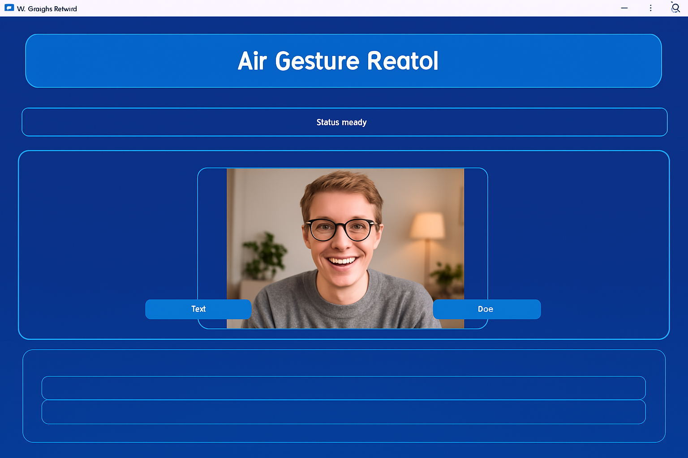

# Air Gesture Control 👋

Control your computer using hand gestures - A Python-based computer vision project

## ✨ Demo & Interface

  

### 🎮 Key Interface Elements
- 📹 Real-time camera feed with hand tracking
- 📊 Status monitoring and feedback
- 🎨 Modern, intuitive blue interface
- 🔘 Easy-to-use control buttons

## 🚀 Quick Start

\\\ash
# Clone the repository
git clone https://github.com/NeerajKumarRay1/airgesture.git

# Create and activate virtual environment
python -m venv venv
.\\venv\\Scripts\\activate  # Windows
source venv/bin/activate # Linux/Mac

# Install dependencies
pip install -e .

# Run the application
python -m airgesture.main
\\\

## 🎯 Features

### 🖱️ Mouse Control
- Move cursor with hand gestures
- Left/right click using gestures
- Scroll up/down functionality

### 🔊 System Control
- Volume adjustment
- Brightness control
- Task view navigation

### 💫 Real-time Processing
- Low latency response
- Smooth cursor movement
- Accurate gesture detection

### 🛠️ Technologies
- Python 3.8+
- OpenCV & MediaPipe
- PyQt5 GUI framework
- System control utilities

## 🤲 Gesture Guide

### Right Hand Controls
| Gesture | Action | Description |
|---------|--------|-------------|
| ✌️ Two fingers up | Move cursor | Keep fingers together |
| 🤏 Pinch | Left click | Spread fingers first |
| 👌 Middle-thumb tap | Right click | After spreading fingers |
| 🤙 Pinky up/down | Brightness | Adjust screen brightness |

### Left Hand Controls
| Gesture | Action | Description |
|---------|--------|-------------|
| ✌️ Two fingers up | Scroll up | Smooth scrolling |
| 👇 All fingers down | Scroll down | Natural movement |
| 🖐️ Open palm | Task view | Windows Task View |
| ☝️ Index finger | Volume | Up/down for adjustment |

## 📦 Requirements

Click to expand

- Python 3.8+
- OpenCV
- MediaPipe
- PyQt5
- PyAutoGUI
- PyCaw
- [Full requirements.txt](requirements.txt)

## 🤝 Contributing

Contributions are welcome! See [CONTRIBUTING.md](CONTRIBUTING.md) for guidelines.

## 📄 License

This project is licensed under the MIT License - see the [LICENSE](LICENSE) file for details.

## 📞 Contact

**Neeraj Kumar Ray**

